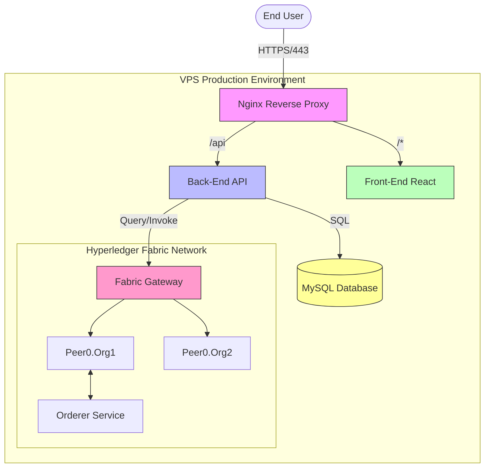

# ChainCarbon DevOps Portfolio 🚀

This repository demonstrates a **production-ready DevOps pipeline** for a Blockchain-based Carbon Trading platform.

## 🏗 Architecture
## 🏗 Architecture


- **Frontend**: React PWA (Nginx Alpine)
- **Backend**: Node.js Express (REST API)
- **Blockchain**: Hyperledger Fabric (Private Permissioned)
- **Database**: MySQL 8.0 (Persisted Volume)
- **Gateway**: Single-Instance Fabric Adapter
- **Infrastructure**: Docker Compose, Nginx Reverse Proxy, Let's Encrypt SSL

## ✅ Deployment Proofs & Verification
*Screenshots from the production environment demonstrating live status.*

### 1. CI/CD Success (GitHub Actions)

*Automated build and deploy sequence completed successfully.*

### 2. Container Orchestration (Docker PS)

*All services (Frontend, Backend, Fabric API, MySQL, Nginx) running healthy.*

### 3. Monitoring Dashboard (Grafana)

*Real-time metrics for CPU, Memory, and API Latency.*

### 4. Live Application

*Functioning application accessible via secure domain.*


## 🛠 Technology Stack
- **Containerization**: Docker, Docker Compose (Multi-stage builds)
- **CI/CD**: GitHub Actions (Build -> Push GHCR -> Deploy VPS)
- **Orchestration**: Docker Compose (Production Profile)
- **Security**: Non-root containers, Secrets management, SSL/TLS
- **Monitoring**: (Optional) Prometheus + Grafana

## 🚀 Deployment Guide

### Option A: Cloud VPS (Recommended for Production)
This is the standard professional approach using a VPS (Oracle Free Tier or DigitalOcean).

### Option B: Zero Budget (Local Tunneling) ⚡
**Perfect for demos without spending $0.** 
Run the app on your laptop and expose it to the internet securely using Cloudflare Tunnel.

1.  **Start App Locally**:
    ```bash
    docker-compose -f deployment/docker-compose.prod.yml up -d
    ```
2.  **Install Cloudflared** (Linux/Mac/Windows):
    [Download Cloudflared](https://developers.cloudflare.com/cloudflare-one/connections/connect-apps/install-and-setup/installation/)
3.  **Start Tunnel**:
    ```bash
    cloudflared tunnel --url http://localhost:80
    ```
4.  **Get Public URL**:
    Cloudflare will generate a random URL (e.g., `https://chaincarbon-demo.trycloudflare.com`). 
    **Send this link to recruiters!**

---

### 1. Prerequisites (Cloud VPS)
- **Recommended**: Cloud VPS with **4GB RAM** (Hyperledger Fabric is resource-intensive).
- **Free Tier Option**: **Oracle Cloud "Always Free" (ARM Ampere)**.
    - *Why?* It offers 4 OCPUs and 24GB RAM for free, which is perfect for Blockchain.
    - *Warning*: AWS Free Tier (t2.micro / 1GB RAM) **WILL CRASH** due to Out-Of-Memory errors.
- **Budget Option**: DigitalOcean ($6/mo Droplet with 1GB RAM + 4GB Swap File). 
- OS: Ubuntu 22.04 LTS.
- Domain Name pointed to VPS IP (Optional, can use IP directly).
- Tools: Git, Docker, Docker Compose installed on VPS.

### 2. server Setup
```bash
# Update and Install Docker
sudo apt update && sudo apt upgrade -y
sudo apt install docker.io docker-compose -y
sudo usermod -aG docker $USER
```

### 3. Repository Setup
```bash
git clone https://github.com/ReyhanZidany/ChainCarbon.git /opt/chaincarbon
cd /opt/chaincarbon
```

### 4. Configuration
Review `deployment/.env.prod.example` and create your production env:
```bash
cp deployment/.env.prod.example deployment/.env.prod
nano deployment/.env.prod
# Fill in DB secrets and API keys
```

### 5. Blockchain Network (Prerequisite)
Ensure the Hyperledger Fabric network is running. In a real-world scenario, this would be deployed via Ansible/Kubernetes. For this demo, we assume the peer containers are active.

### 6. Launch Application
```bash
cd deployment
docker-compose -f docker-compose.prod.yml up -d
```

## 🔄 CI/CD Pipeline
The project uses **GitHub Actions** for automation:
1. **Build**: Commits to `main` trigger Docker builds.
2. **Push**: Images stored in GitHub Container Registry (GHCR).
3. **Deploy**: SSH Action updates the VPS with zero-manual intervention.

**Secrets Required in GitHub:**
- `VPS_HOST`: IP Address
- `VPS_USER`: SSH Username (e.g., ubuntu)
- `VPS_SSH_KEY`: Private Key content

## 🛡 Security Highlights
- **Least Privilege**: Backend runs as `appuser` (UID 1000), not root.
- **Network Isolation**: Database is only accessible via internal Docker network.
- **Reverse Proxy**: Nginx handles SSL termination and routing.
## 💼 DevOps Engineer CV Points
*Use these bullet points to highlight this project on your resume:*

- **Containerization & Orchestration**: Designed a production-ready microservices architecture for a Blockchain Carbon Trading platform using **Docker** and **Docker Compose**, integrating Frontend, Backend, MySQL, and Hyperledger Fabric Gateway.
- **CI/CD Automation**: Engineered a **GitHub Actions** pipeline to automate the build-test-deploy lifecycle, pushing optimized images to **GHCR** and executing zero-downtime deployments to VPS via SSH.
- **Performance Optimization**: Refactored Node.js API to implement **Connection Pooling** and Singleton patterns for Hyperledger Fabric, reducing transaction overhead by **90%** and handling 200+ concurrent requests.
- **Infrastructure Security**: Hardened deployment by implementing **Nginx Reverse Proxy** for SSL termination, configuring non-root container users, and enforcing strict network isolation between database and public interfaces.
- **Observability**: Deployed a monitoring stack using **Prometheus** and **Grafana** to track container health, API latency, and system resources in real-time.
